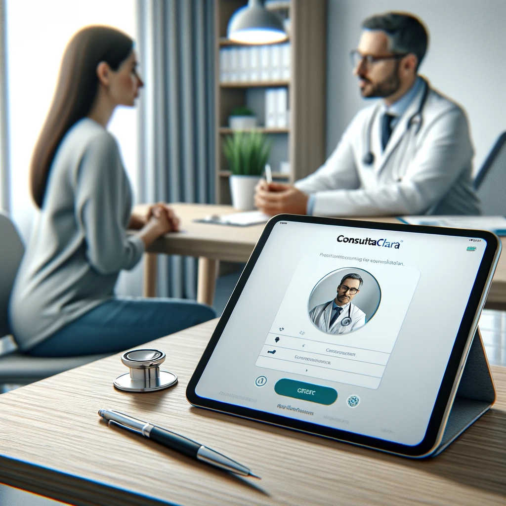
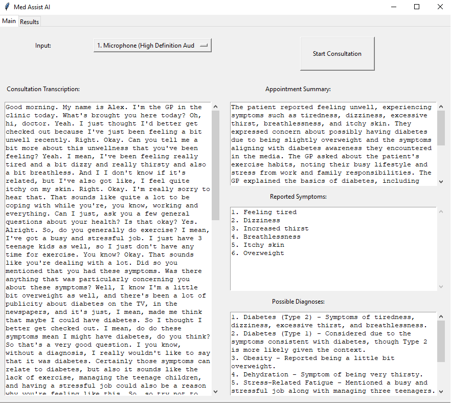

# MedConsult Transcript and Analysis

## Introduction
Record live consultations and with a single click transcribe the audio, creating outputs for both medical diagnosis and system registration, ensuring accuracy and efficiency in patient care and record-keeping.

## Use
Click the button to start recording.
Click the button to stop recording and generate transcription + reports.

## Example Consultation
Using the following consultation video as an example:

[YouTube Video](https://www.youtube.com/watch?v=swftId4w404) (From 2:16 to 7:20)

We get the following report:

